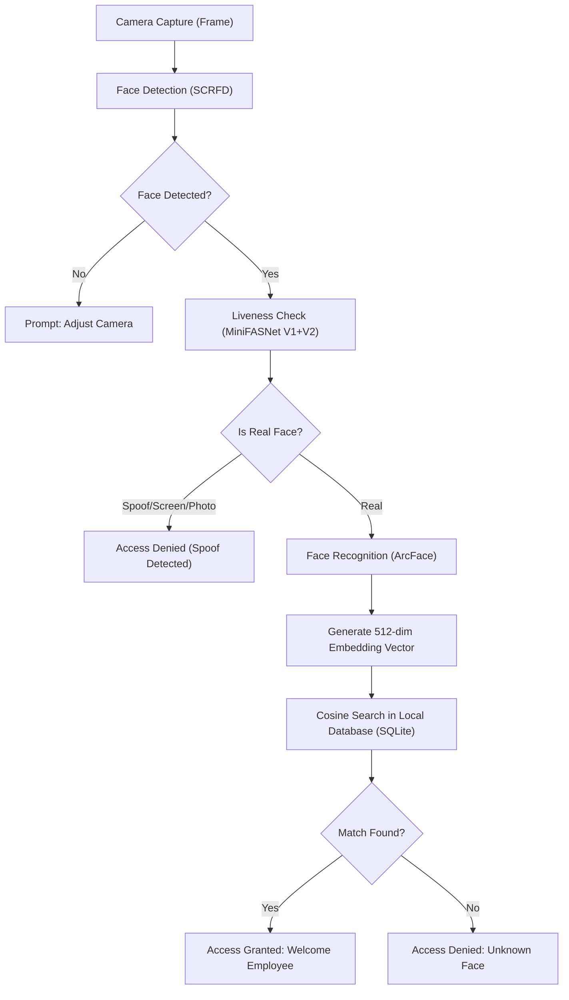

# NHAI FaceGuard: Secure Offline Biometrics
### *Develop a mobile-based secure offline facial recognition and liveness detection system for remote locations*

---

## 📌 Executive Summary

The **NHAI FaceGuard SDK** is a lightweight, edge-optimized, and secure biometric solution developed for the **NHAI Innovation Hackathon 7.0**. The system enables 100% offline face enrollment, verification (1:1), and identification (1:N) with built-in passive liveness detection. 

Designed specifically for remote highway zones, toll plazas, and construction sites with zero or unstable internet connectivity, it runs entirely on local CPU resources with a model footprint of **under 7 MB**. By removing dependency on cloud-based APIs, the SDK eliminates subscription fees, guarantees data privacy, and lowers verification latency to less than 200 milliseconds.

---

## 📖 Table of Contents
1. [Problem Statement](#-problem-statement)
2. [Proposed Solution](#-proposed-solution)
3. [System Architecture](#-system-architecture)
4. [Machine Learning Pipeline](#-machine-learning-pipeline)
5. [Implementation Stack](#-implementation-stack)
6. [How it Works & Integration Guide](#-how-it-works--integration-guide)
7. [Business Value & Project Impact](#-business-value--project-impact)

---

## 🚨 Problem Statement

The National Highways Authority of India (NHAI) monitors field operations, toll collectors, construction crews, and maintenance teams across lakhs of kilometers of highways. Validating identities on-site is critical to prevent proxy attendance ("buddy punching") and ensure security. However, current cloud-based biometric systems face severe operational bottlenecks:

* 📡 **Network Deprivation**: Many highway construction stretches, underpasses, tunnels, and rural plazas suffer from weak or non-existent 4G/5G signals. Cloud APIs fail entirely in these conditions.
* 🎭 **Biometric Fraud (Spoofing)**: Basic facial recognition is easily bypassed by presenting a printed photo of an employee or playing a video on a mobile screen in front of the camera.
* 💰 **Exorbitant Cloud Costs**: Scaled cloud biometrics charge per transaction or per active user, creating a recurring financial burden.
* 🔒 **Privacy Risks**: Uploading raw facial imagery to third-party cloud servers increases the risk of data leakage and non-compliance with data residency policies.

---

## 💡 Proposed Solution

**NHAI FaceGuard** addresses these pain points by shifting the entire computer vision and machine learning pipeline to the **edge**. 

> [!IMPORTANT]
> **Zero Network Dependency**: This system requires absolutely no internet access to perform facial recognition or liveness detection. It is designed to work in deep valleys, remote forests, and shielded rooms.

### Key Pillars of the System:
1. **Passive Liveness Detection**: Uses texture, reflection, and depth cue patterns to classify a face as `REAL` or `SPOOF` (photo print, mobile screen, or mask) without requiring user actions like blinking or turning.
2. **On-Device Database (SQLite)**: Face templates are converted to 512-dimensional numerical vectors (embeddings) and stored locally. No original photos are saved, and no data leaves the device.
3. **Ultra-Lightweight Footprint**: Optimized to run on basic mobile hardware or local computers, avoiding the need for expensive GPUs.

---

## 🏗 System Architecture

The following diagram illustrates the sequential stages of the edge-processing pipeline:



---

## 🧠 Machine Learning Pipeline

The SDK partitions the task into a modular four-stage pipeline:

| Module | Component | Model Used | Footprint | Details / Role |
| :--- | :--- | :--- | :--- | :--- |
| **1. Detection** | `detector.py` | SCRFD 500M (ONNX) | ~1.0 MB | Detects bounding boxes and 5-point facial landmarks (eyes, nose, mouth corners) even with face rotation or partial occlusions. |
| **2. Liveness** | `liveness.py` | MiniFASNet V1 + V2 | ~2.0 MB | Passive 2-model ensemble analyzing high-frequency texture anomalies to reject printed paper/screens. |
| **3. Recognition** | `recognizer.py` | ArcFace MobileFaceNet | ~4.0 MB | Aligns face landmarks to 112×112px, then extracts a standardized 512-dimensional vector embedding. |
| **4. Storage** | `database.py` | SQLite DB | Negligible | Local SQL database mapping unique Person IDs to their name, registration metadata, and binary vector blob. |

### Liveness Detection Mechanism
Instead of requesting active user collaboration (such as blinking or smiling), NHAI FaceGuard implements **passive anti-spoofing**:
* **Texture & Boundary Analysis**: Detects paper edges, screen borders, and artificial reflections.
* **Frequency Analysis**: Identifies Moiré patterns caused by capturing digital screens.
* **Dual-Model Ensemble**: Runs both V1 and V2 architectures of MiniFASNet in parallel for maximum accuracy.

---

## 🛠 Implementation Stack

The application is written in clean, production-grade Python:
* **Core ML Engine**: `onnxruntime` (runs compiled ONNX models on CPU efficiently).
* **Image Processing**: `opencv-python`, `Pillow`, and `scipy` (handling frames, landmark alignment, and matrix math).
* **API Layer**: `fastapi` and `uvicorn` (provides a lightweight REST API for local applications or mobile clients).
* **Biometric Model Wrappers**: `insightface` (industrial-standard face analysis library).

---

## 💻 How it Works & Integration Guide

### 1. One-Time Setup & Download
First, install dependencies and download the model binaries locally. This requires internet access *once*. After this step, you can disconnect the network permanently.

```bash
pip install -r requirements.txt
python download_models.py
```

### 2. Run the Local API Server
Start the FastAPI server to expose endpoints locally:
```bash
python api/server.py
```
* **API Endpoint**: `http://127.0.0.1:8000`
* **Interactive Web UI**: `http://127.0.0.1:8000/`
* **Swagger Documentation**: `http://127.0.0.1:8000/docs`

> [!TIP]
> Use the **Interactive Web UI** to test the system easily from any mobile device or laptop browser connected to the local network.

### 3. API Examples

#### Register a Face (`POST /register`)
```bash
curl -X POST http://127.0.0.1:8000/register \
  -H "Content-Type: application/json" \
  -d '{
    "person_id": "EMP001",
    "person_name": "Arjun Sharma",
    "image_b64": "<BASE64_IMAGE_DATA>"
  }'
```

#### Identify a Face (`POST /identify`)
```bash
curl -X POST http://127.0.0.1:8000/identify \
  -H "Content-Type: application/json" \
  -d '{
    "image_b64": "<BASE64_IMAGE_DATA>",
    "check_liveness": true
  }'
```

---

## 📈 Business Value & Project Impact

### 1. Comparison: Offline SDK vs. Traditional Cloud Biometrics

| Metric | NHAI FaceGuard SDK (Offline) | Cloud Facial recognition (AWS/Azure/Face++) |
| :--- | :--- | :--- |
| **Network Dependency** | **None** (100% offline) | Requires active, low-latency internet |
| **Operational Latency**| **~120ms - 180ms** (Instant Local CPU) | ~800ms - 2500ms (dependent on network speed) |
| **Data Privacy** | **Maximum** (No images leave the edge device) | Lower (Images or biometrics sent to remote servers) |
| **Transaction Cost** | **₹0 (Free)** | Recurring fees per request |
| **Spoof Prevention** | **Yes** (Double-model passive ensemble) | Often requires custom integration or premium tier |

### 2. Impact on NHAI Operations
* 🛠 **Uninterrupted Operations**: Field supervisors can verify worker shifts directly from mobile phones or offline tablets in tunnels, high-altitude passes, and rural highways.
* 📉 **Zero Operating Costs**: Because it uses open-source, edge-compatible models, there are no software licensing costs or cloud processing fees, saving lakhs in operating expenses.
* 🛡 **Ironclad Fraud Control**: The passive liveness detector immediately flags workers attempting to present printed photos or videos of colleagues, maintaining audit integrity.
* 🔐 **Enhanced Data Security**: Storing only high-entropy, 512-dimension mathematical embeddings instead of raw photos ensures that even if a local device is lost or stolen, biometric face data cannot be reconstructed.
